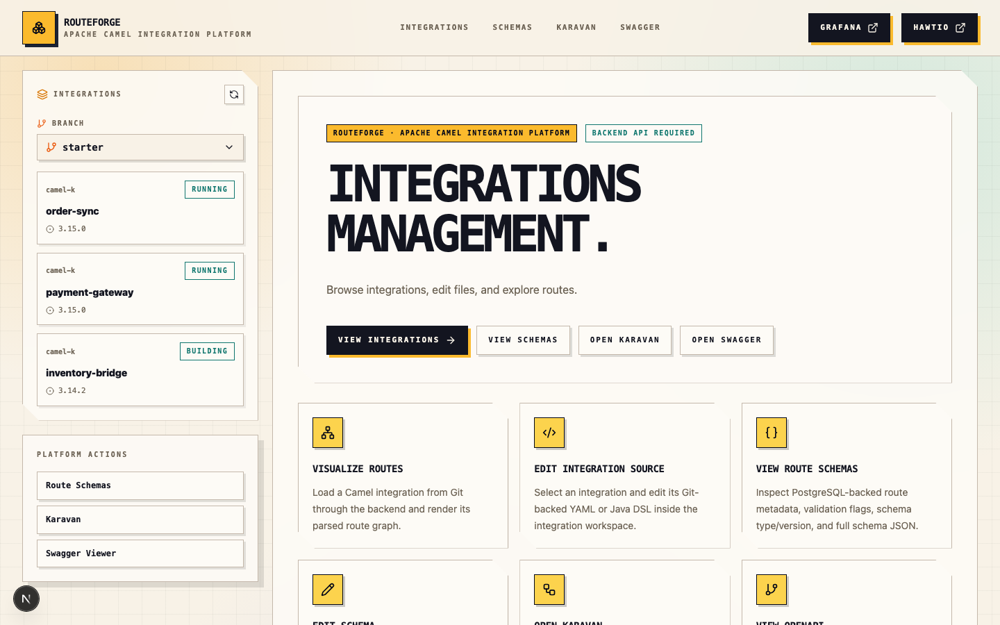
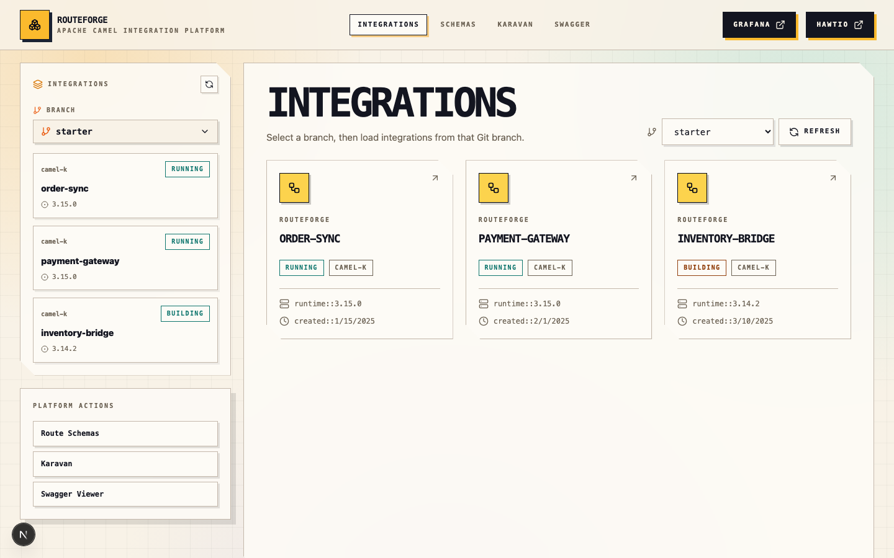
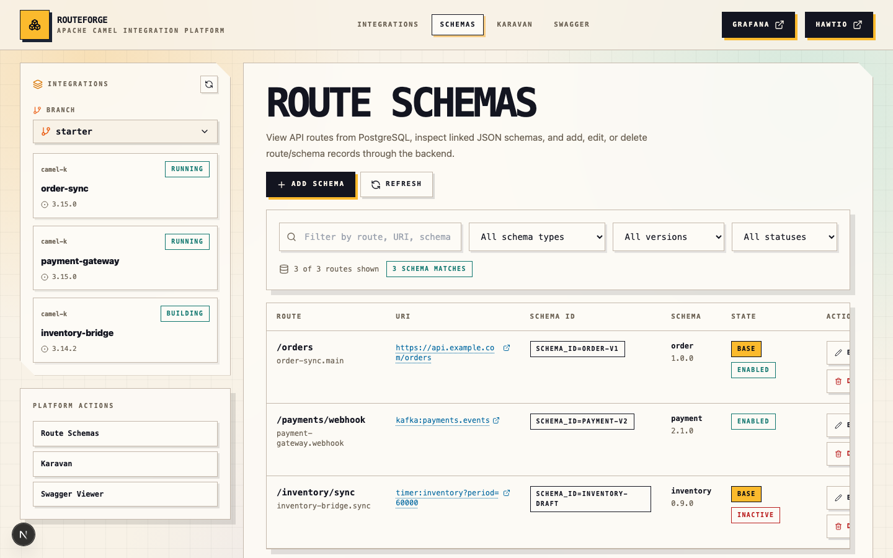
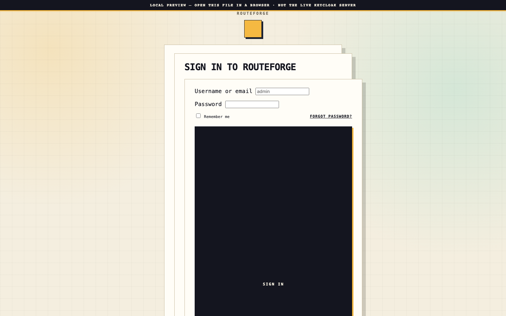

# RouteForge

**Apache Camel Integration Platform** — a personal portfolio project by [Tselot Beyene](https://github.com/TselotBeyene).

RouteForge is a Next.js frontend for managing Apache Camel integrations on Kubernetes. Browse Git-backed integration services, visualize route graphs, edit YAML/Java DSL sources, manage PostgreSQL route schemas, and launch Karavan or Swagger UI from a single workspace.

**Live demo:** [routeforge.onrender.com](https://routeforge.onrender.com) *(portfolio mode — auth disabled, backend optional)*

## Screenshots

| Home | Integrations |
|------|--------------|
|  |  |

| Schemas | Keycloak login theme |
|---------|----------------------|
|  |  |

## Features

- **Integration catalog** — browse Camel K integrations with live phase and namespace status
- **Route visualization** — interactive React Flow graphs parsed from integration routes
- **Source editing** — Monaco editor for Git-backed YAML and Java DSL files
- **Schema management** — CRUD for PostgreSQL-backed route metadata and JSON schemas
- **Embedded tooling** — Karavan designer and Swagger UI when backend URLs are configured
- **Auth** — Keycloak OIDC via NextAuth with a custom-branded login theme

## Tech stack

| Layer | Technologies |
|-------|-------------|
| Framework | Next.js 15, React 19, TypeScript |
| Styling | Tailwind CSS, custom design system |
| State | Zustand |
| Visualization | React Flow (`@xyflow/react`) |
| Editor | Monaco Editor |
| API | Axios BFF proxy with NextAuth session tokens |

## Getting started

### Prerequisites

- Node.js 22+
- A running Camel K integration backend (Spring Boot)
- Keycloak realm configured for OIDC (optional for local UI exploration)

### Install and run

```bash
npm install
cp .env.example .env.local   # adjust values for your environment
npm run dev
```

Open [http://localhost:3000](http://localhost:3000).

### Environment variables

Copy `.env.example` to `.env.local` and adjust values. Key variables:

| Variable | Description |
|----------|-------------|
| `BACKEND_URL` | Camel K integration backend base URL |
| `KEYCLOAK_ISSUER` | Keycloak realm issuer URL |
| `KEYCLOAK_CLIENT_ID` | OIDC client ID |
| `KEYCLOAK_CLIENT_SECRET` | OIDC client secret |
| `NEXTAUTH_SECRET` | NextAuth session encryption secret |
| `NEXT_PUBLIC_KARAVAN_URL` | Optional Karavan designer URL |
| `DEMO_MODE` | Set `true` to skip auth for portfolio demos |

### Keycloak login theme

A custom login theme lives in `keycloak/themes/routeforge`. After deploying the theme to your Keycloak server, set **Login theme** to `routeforge` in realm settings and ensure the OIDC client uses `kc_theme: routeforge` (already configured in `lib/auth/options.ts`).

## Scripts

```bash
npm run dev        # development server
npm run build      # production build
npm run start      # start production server
npm run lint       # ESLint
npm run typecheck  # TypeScript check
```

## Deploy

### Render (recommended)

This repo includes a [`render.yaml`](render.yaml) Blueprint. After pushing to GitHub:

1. Open [Create Blueprint on Render](https://dashboard.render.com/blueprint/new?repo=https://github.com/TselotBeyene/RouteForge)
2. Apply the Blueprint — `DEMO_MODE=true` is preconfigured for portfolio browsing
3. Set `NEXTAUTH_URL` to your Render service URL (e.g. `https://routeforge.onrender.com`)

### Vercel

```bash
npx vercel
```

Set `DEMO_MODE=true` in project environment variables for a public UI demo without Keycloak.

### Docker

```bash
docker build -t routeforge .
docker run -p 3000:3000 --env-file .env.local routeforge
```

## Project structure

```
app/              Next.js App Router pages and API routes
components/       Shared UI (navbar, cards, modals)
features/         Feature modules (schemas, visualization, swagger)
lib/              Auth, API client, navigation, brand constants
services/         Backend API service layer
keycloak/         Custom Keycloak login theme
```

## License

MIT — personal portfolio project. Feel free to reference or fork with attribution.
